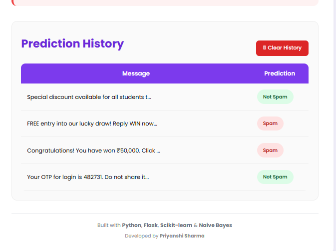

# 📧 SMS Spam Detector

A Machine Learning based web application that classifies SMS messages as **Spam** or **Not Spam** using the **Naive Bayes** algorithm.

The application is built using **Python, Flask, Scikit-learn, HTML and CSS**. It allows users to enter an SMS message and instantly receive a prediction along with the confidence score. It also stores recent predictions so that users can review previous results.

---

# 📖 About the Project

Spam messages are one of the most common forms of unwanted communication. Identifying them manually is not always easy, especially when large numbers of messages are received.

This project uses a Machine Learning model to automatically classify SMS messages as **Spam** or **Not Spam**. Before prediction, the message is cleaned and converted into numerical features using **CountVectorizer**. The trained **Naive Bayes** model then predicts the category of the message and displays the result on a simple web interface.

---

# ✨ Features

- Detects Spam and Not Spam SMS messages
- Displays prediction confidence score
- Stores recent prediction history
- Clear History option
- Simple and responsive user interface
- Fast prediction using a trained Machine Learning model

---

# 🛠️ Technologies Used

| Technology | Purpose |
|------------|---------|
| Python | Programming Language |
| Flask | Backend Web Framework |
| Scikit-learn | Machine Learning |
| Pandas | Data Processing |
| NumPy | Numerical Operations |
| Joblib | Saving & Loading Model |
| HTML5 | Frontend |
| CSS3 | Styling |
| Naive Bayes | Classification Algorithm |

---

# 📸 Project Screenshots

## 🏠 Home Page

<p align="center">

</p>

---

## 📊 Prediction Result

<p align="center">

</p>

---

## 📜 Prediction History

<p align="center">

</p>

---

# 📂 Project Structure

```text
sms-spam-detector
│
├── dataset/
│   └── spam.csv
│
├── models/
│   ├── spam_model.pkl
│   └── vectorizer.pkl
│
├── screenshots/
│   ├── home.png
│   ├── prediction.png
│   └── history.png
│
├── templates/
│   └── index.html
│
├── app.py
├── preprocess.py
├── train_model.py
├── requirements.txt
├── README.md
└── .gitignore
```

---

# ⚙️ Working of the Project

1. The user enters an SMS message.
2. The message is cleaned during preprocessing.
3. The cleaned text is converted into numerical features using **CountVectorizer**.
4. The trained **Naive Bayes** model predicts whether the message is Spam or Not Spam.
5. The prediction result and confidence score are displayed.
6. The prediction is saved in the recent history section.

---

# 🚀 Installation

### Clone the Repository

```bash
git clone https://github.com/priyanshi1009/sms-spam-detector.git
```

### Move to the Project Folder

```bash
cd sms-spam-detector
```

### Create a Virtual Environment

```bash
python -m venv venv
```

### Activate the Virtual Environment

**Windows**

```bash
venv\Scripts\activate
```

### Install Required Libraries

```bash
pip install -r requirements.txt
```

### Run the Application

```bash
python app.py
```

Open your browser and visit:

```text
http://127.0.0.1:5000
```

---

# 📊 Model Details

| Parameter | Value |
|-----------|-------|
| Algorithm | Naive Bayes |
| Problem Type | Binary Text Classification |
| Dataset | SMS Spam Collection Dataset |
| Accuracy | Approximately 98% |

---

# 📋 Sample Predictions

| SMS Message | Prediction |
|-------------|------------|
| Hi, are you coming to college tomorrow? | ✅ Not Spam |
| Your OTP is 482731. Do not share it with anyone. | ✅ Not Spam |
| Congratulations! You have won ₹50,000. | 🚫 Spam |
| FREE entry into our lucky draw! | 🚫 Spam |

---

# 🔮 Future Improvements

Some features that can be added in the future include:

- Email Spam Detection
- Multi-language Support
- User Authentication
- Database Integration
- Cloud Deployment
- Mobile Responsive Design
- Deep Learning based Text Classification

---

# 📚 Learning Outcomes

This project helped me understand:

- Text preprocessing
- Feature extraction using CountVectorizer
- Naive Bayes Classification
- Machine Learning workflow
- Flask web development
- Git and GitHub
- Building an end-to-end Machine Learning application

---

# 👩‍💻 Author

**Priyanshi Sharma**

B.Tech Student

**GitHub Profile:**  
https://github.com/priyanshi1009

**Project Repository:**  
https://github.com/priyanshi1009/sms-spam-detector

---

# 🙏 Acknowledgement

The SMS Spam Collection Dataset used in this project is a publicly available dataset that is widely used for learning and research in text classification.

---

⭐ Thank you for taking the time to explore this project.