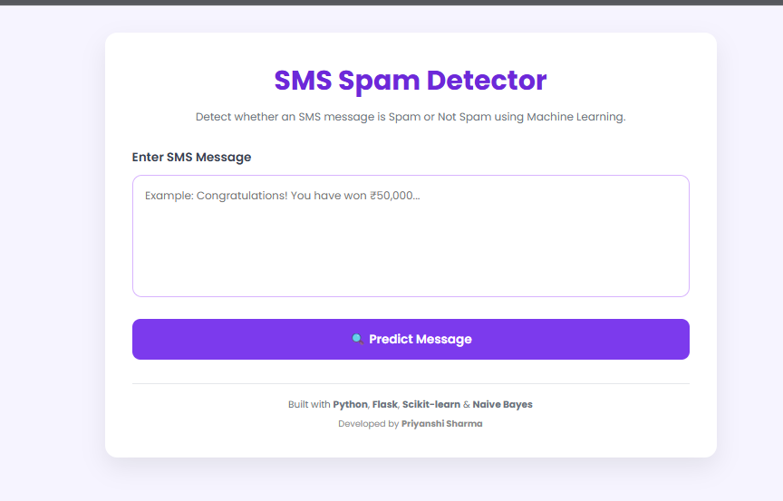
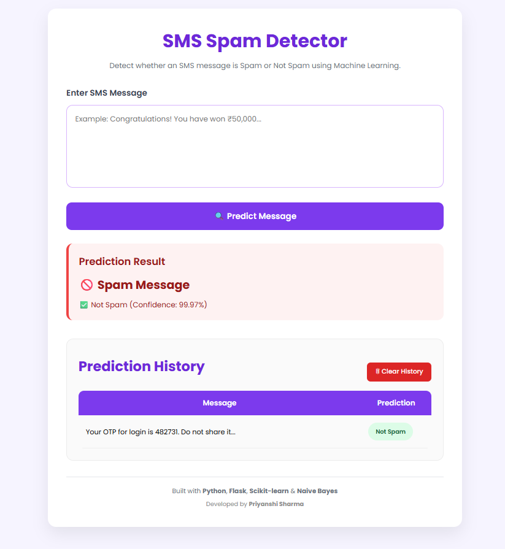

# 📧 SMS Spam Detector

A simple Machine Learning web application that detects whether an SMS message is **Spam** or **Not Spam** using the **Naive Bayes** algorithm.

The project is developed using **Python, Flask, Scikit-learn, HTML and CSS**. It provides a clean web interface where users can enter any SMS message and instantly receive the prediction along with the confidence score.

---

## 📸 Screenshots

### 🏠 Home Page

<p align="center">
  
</p>

---

### 📊 Prediction Result

<p align="center">
  
</p>

---

# 📖 About the Project

Spam messages are one of the most common forms of unwanted communication. This project aims to automatically classify SMS messages as **Spam** or **Not Spam** using Machine Learning.

The application uses the **Naive Bayes Classifier**, which is widely used for text classification problems. Before prediction, the message is cleaned and converted into numerical features using **CountVectorizer**. The trained model then predicts the category of the message and displays the result with a confidence score.

The application also keeps a history of recent predictions, making it easier to review previous results.

---

# ✨ Features

- Detects Spam and Not Spam SMS messages
- Displays prediction confidence score
- Stores recent prediction history
- Clear History option
- Simple and responsive web interface
- Fast prediction using a trained Machine Learning model

---

# 🛠️ Technologies Used

| Technology | Purpose |
|------------|---------|
| Python | Programming Language |
| Flask | Backend Web Framework |
| Scikit-learn | Machine Learning |
| Pandas | Data Handling |
| NumPy | Numerical Operations |
| Joblib | Model Saving & Loading |
| HTML5 | Frontend |
| CSS3 | Styling |
| Naive Bayes | Classification Algorithm |

---

# 📂 Project Structure

```text
sms-spam-detector
│
├── dataset/
│   └── spam.csv
│
├── models/
│   ├── spam_model.pkl
│   └── vectorizer.pkl
│
├── screenshots/
│   ├── home.png
│   └── prediction.png
│
├── templates/
│   └── index.html
│
├── app.py
├── preprocess.py
├── train_model.py
├── requirements.txt
├── README.md
└── .gitignore
```

---

# ⚙️ How It Works

1. The user enters an SMS message.
2. The message is preprocessed by removing unnecessary characters.
3. The cleaned text is converted into numerical features using **CountVectorizer**.
4. The trained **Naive Bayes** model predicts whether the message is Spam or Not Spam.
5. The prediction result and confidence score are displayed.
6. The prediction is stored in the recent history section.

---

# 🚀 Installation

### Clone the Repository

```bash
git clone https://github.com/priyanshi1009/sms-spam-detector.git
```

### Move into the Project Folder

```bash
cd sms-spam-detector
```

### Create a Virtual Environment

```bash
python -m venv venv
```

### Activate the Virtual Environment

**Windows**

```bash
venv\Scripts\activate
```

### Install Required Libraries

```bash
pip install -r requirements.txt
```

### Run the Application

```bash
python app.py
```

Open your browser and visit:

```
http://127.0.0.1:5000
```

---

# 📊 Model Details

| Parameter | Value |
|-----------|-------|
| Algorithm | Naive Bayes |
| Problem Type | Binary Text Classification |
| Dataset | SMS Spam Collection Dataset |
| Accuracy | Approximately 98% |

---

# 📋 Sample Predictions

| SMS Message | Prediction |
|-------------|------------|
| Hi, are you coming to college today? | ✅ Not Spam |
| Your OTP is 458271. Do not share it. | ✅ Not Spam |
| Congratulations! You have won ₹50,000. | 🚫 Spam |
| FREE entry into our lucky draw! | 🚫 Spam |

---

# 🔮 Future Scope

The project can be improved further by adding:

- Email spam detection
- Support for multiple languages
- User authentication
- Database integration
- Cloud deployment
- Mobile-friendly interface
- Deep Learning based text classification

---

# 📚 Learning Outcomes

While working on this project, I learned about:

- Text preprocessing
- Feature extraction using CountVectorizer
- Naive Bayes Classification
- Model training and evaluation
- Flask web development
- Git and GitHub workflow
- Building an end-to-end Machine Learning application

---

# 👩‍💻 Author

**Priyanshi Sharma**

B.Tech Student

GitHub Profile:  
🔗 **https://github.com/priyanshi1009**

Project Repository:  
🔗 **https://github.com/priyanshi1009/sms-spam-detector**

---

## 🙏 Acknowledgement

The SMS Spam Collection Dataset used in this project is a publicly available dataset commonly used for text classification and spam detection tasks.

---

⭐ *Thank you for visiting this project!*